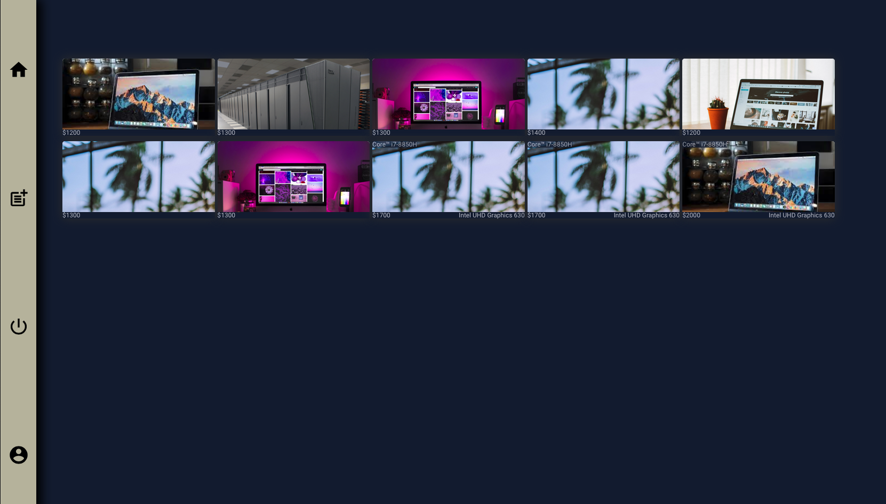
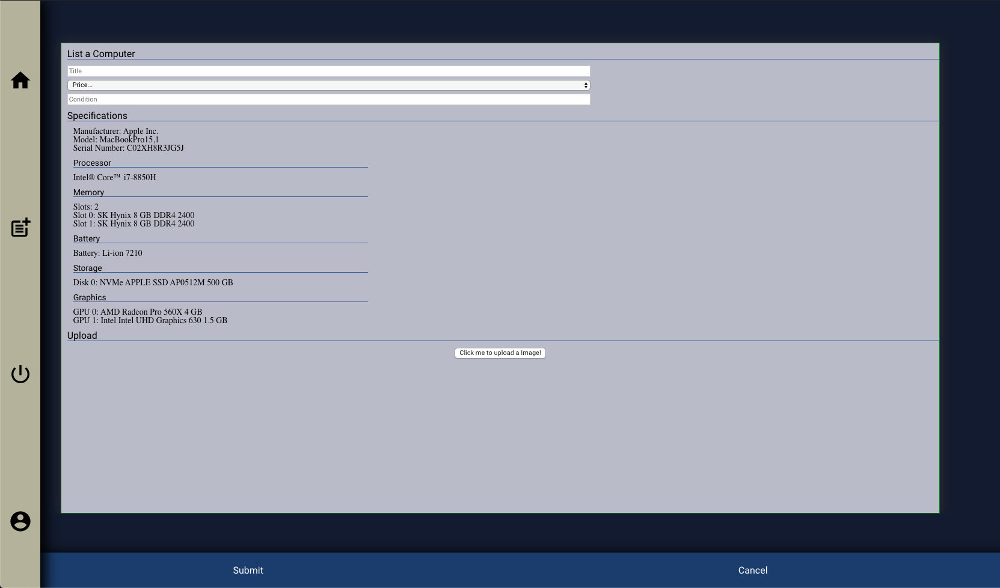

# Reforged Machines
___

Reforged Machines is an app designed with only one purpose in mind: make buying and selling your computer easier. Want to sell that old gaming rig with a 980ti? done. Want to get some money out of that Macbook Pro that got you through college? Reforged Machines has your back.

## Getting Started (Developer)
 - To start, fork and clone this repo.
 - Create a .env file, and make sure to add it to your gitignore file.
 - For the .env, you will need the following:

```
SERVER_PORT=
SESSION_SECRET=
TWILIO_ACCOUNT_SECRET_ID=
TWILIO_STUDIO_ID=
TWILIO_AUTH_TOKEN=
TWILIO_FLOW=
TWILIO_VERIFY_SID=
TWLIO_PHONE_NUMBER=
AWS_ACCESS_KEY_ID=
AWS_SECRET_ACCESS_KEY=
S3_BUCKET=

# ARN AWS IAM userid/bucketname
```
## Getting Started (Client Side)

- Click register, and fill out the form to create an account:


- The app will then return you to the main login screen to login.


## The Dashboard

The dashboard is the main "hub" of the app, where the computers currently listed for sale appear. Each box shows a picture of the computer, along with it's price, processor, and graphics card. To get more information about a particular computer, click on the box to load it's main post page.



## Navigation

 
- The house icon will direct you back to the dashboard when clicked.
- This "New Document" icon will direct you to the post creation page when clicked.
- The power icon will end the session, and logout you out of the app when clicked.
- The profile icon will direct you to the account page, where you can edit or remove any posts created by your account.

## Create

Create is where you can specify a title, price, specifications, and a picture for your computer. To get the specifications of your computer, click the "pull specs" button. "Pull specs" calls a server endpoint that returns your computer's specs using [systeminformation - npm](https://www.npmjs.com/package/systeminformation). Note that the information is parsed on the backend, so that we only get the information relevant to selling the computer. To upload an image for the post, just click on the button below "Upload," and specify a file. After that click submit and you are done! Your post will now appear under dashboard.



## Post

Post is where we see the more detailed information about a computer. Here we can see who made the computer, the model of the machine, processor, ram, battery (if your computer is detected as a laptop), storage (number of disks, type, and capacity), and graphics cards (including integrated processors).

If you are happy with what you see, you can enter your name and phone number at the bottom of the page and click "call me." A chatbot will then call your phone and confirm the details of the computer, before connecting you with the seller to finalize the details.

**NOTE:** Please make sure you enter your phone number in E164 format: +1##########. Otherwise, this feature will not work.

## Account

The Account page will display any posts created by your account, and give you the option to either edit or delete them one by one.


## Built With
___
 - ....Deep breath:
 - [React – A JavaScript library for building user interfaces](https://reactjs.org/)
 - [S3 - AWS](https://aws.amazon.com/tools/)
 - [Animate.css](https://daneden.github.io/animate.css/)
 - [axios - npm](https://www.npmjs.com/package/axios)
 - [Home \| MassiveJS](https://massivejs.org/)
 - [React Redux · Official React bindings for Redux](https://react-redux.js.org/)
 - [systeminformation](https://systeminformation.io/)
 - [twilio - npm](https://www.npmjs.com/package/twilio)
 - [uuid - npm](https://www.npmjs.com/package/uuid)
 - [redux - npm](https://www.npmjs.com/package/redux)
 - [react-touch - npm](https://www.npmjs.com/package/react-touch)
 - [react-reveal - npm](https://www.npmjs.com/package/react-reveal)
 - [react-router-dom - npm](https://www.npmjs.com/package/react-router-dom)
 - [express - npm](https://www.npmjs.com/package/express)
 - [express-sessions - npm](https://www.npmjs.com/package/express-sessions)
 - [bcrypt - npm](https://www.npmjs.com/package/bcrypt)
 - [dotenv - npm](https://www.npmjs.com/package/dotenv)

## Authors
___

- **Ben Eccles** - v1 Prototype


## Acknowledgments
___
- @kung8 for their S3 and Twilio examples.
- My brother Court for listening as I talked through programming bugs.


